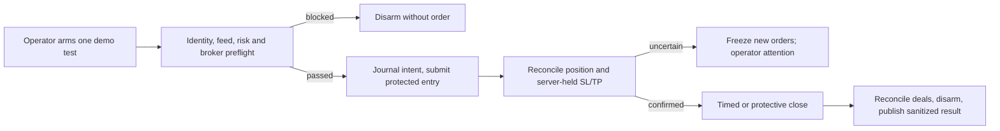

# Gold agent task plan

This is the design decision for the owner's 2026-09-29 goal. The immediate milestone is one supervised, automatically managed **demo** trade on `XAUUSD-VIP`; the end goal is a separately approved, continuously running demo strategy with AI research and results visible in `/vault/trading`.

## Approaches considered

| Approach | Benefit | Cost / risk |
| --- | --- | --- |
| Direct MT5 order script | Fastest API proof | No durable intent, restart recovery or safe handling of a lost reply |
| **Separate one-shot runner (selected)** | Proves the complete order lifecycle while keeping the observer and researcher separate | Requires a small journal, reconciliation and a supervised arming step |
| Connect the observer or AI directly to orders | Fewer processes initially | Couples unqualified signals or research to trading authority and makes rollback harder |

The owner selected a one-shot armed runner and a controlled minimum-lot test entry. The operator supplies `buy` or `sell` when arming; the AI and existing EMA signal do not choose this smoke-test direction. The runner expires its arm after 15 minutes, makes at most one entry attempt, attaches broker-held stop loss and take profit in the entry request, checks the resulting position, then closes it after 60 seconds if neither protective order has closed it. It disarms after closure. If minimum lot would breach the 0.1%-of-current-equity stop-risk ceiling or broker rules prevent protected entry, it places no order. The smoke result is engineering evidence, not a strategy win or qualification. The hard one-attempt limit replaces a recurring daily-entry loop for this test; the continuous runner later needs the persisted 1% daily pause before it can trade.

The current read-only observer remains a separate process and retains its Algo-Trading-off guard. One-shot execution has its own pinned demo guard, journal and sanitized status. No browser button, MCP tool, model job or automatic strategy entry can arm it. Its default is disarmed; a container restart may reconcile an already submitted attempt but never creates a new entry. While a position exists, uncertainty means reconcile first and never blindly resend. An unresolved or unprotected position needs operator attention; it cannot be reported as a successful test.

## Delivery order

1. **One-shot demo execution machinery:** implement the separate runner and private journal, test failures/restarts with a fake MT5 boundary, show sanitized status on the existing authenticated trading page, then run one supervised demo attempt. [Implementation plan](2026-09-29-gold-one-shot-demo-execution.md). This is a narrow execution test and does not satisfy Batch 2/3 strategy gates.
2. **Batch 2 trustworthy evaluation:** retain the approved prospective policy. Dated account-specific costs, historical UTC semantics, an adequately covered new dataset and three frozen folds are still required before a candidate can qualify.
3. **Batch 3 AI research:** after Batch 2 gates, verify the pinned Vibe-Trading/model invocation route and run one isolated, registered proposal. The researcher has no order, credential, risk-policy or promotion authority.
4. **Batch 4 forward observation:** compare baseline and accepted candidate on new prices without orders; show model version, evidence period and simulated outcomes on the authenticated page.
5. **Continuous demo execution:** a distinct later plan joins only an owner-approved strategy to the proven runner, with one position, persistent daily pause, restart recovery and rollback. Promotion remains an owner action. Nothing in steps 1–4 enables continuous orders.

No live account, automatic promotion, new paid provider or profitability claim is in scope. Algo Trading stays off until the supervised one-shot activation step, and the operator turns it off again after reconciliation. The broker-held stop is a risk control, not a guaranteed fill price or loss cap.
